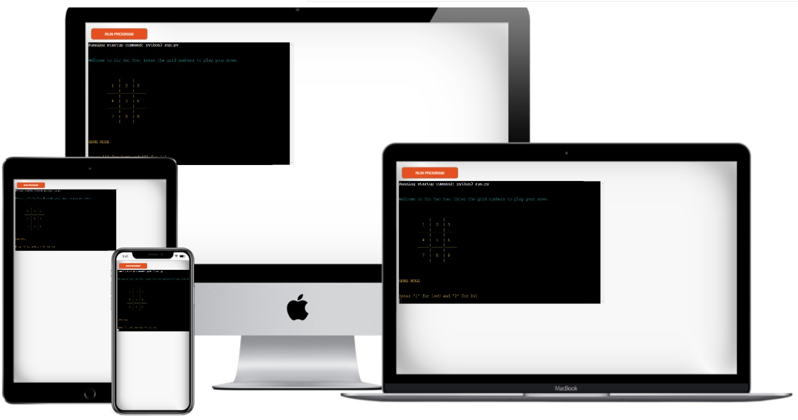
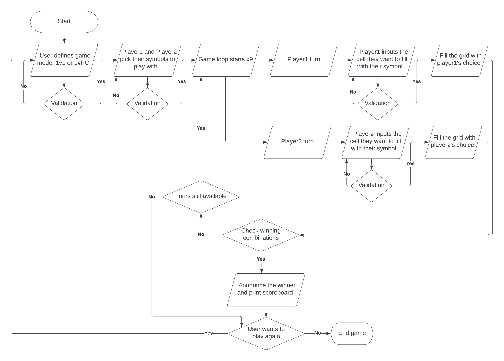
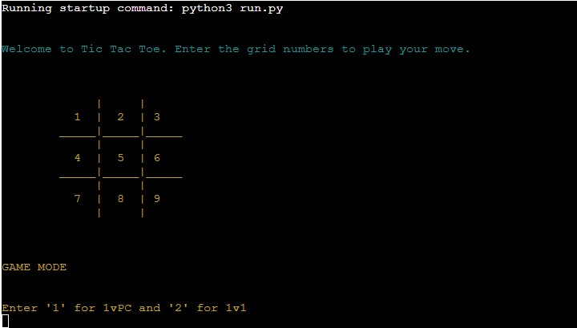
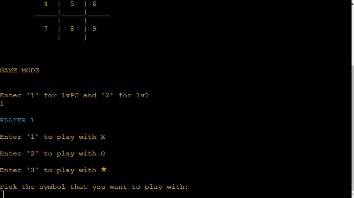
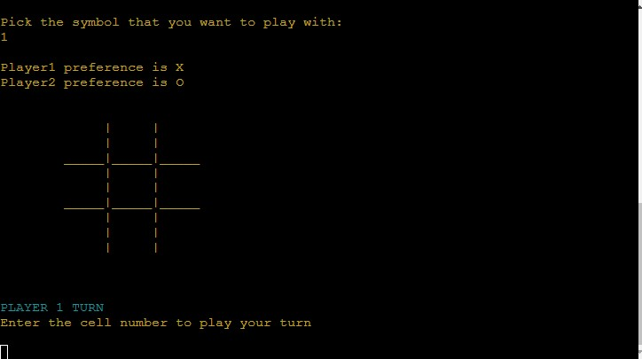
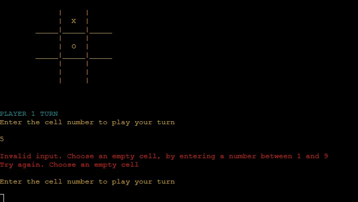
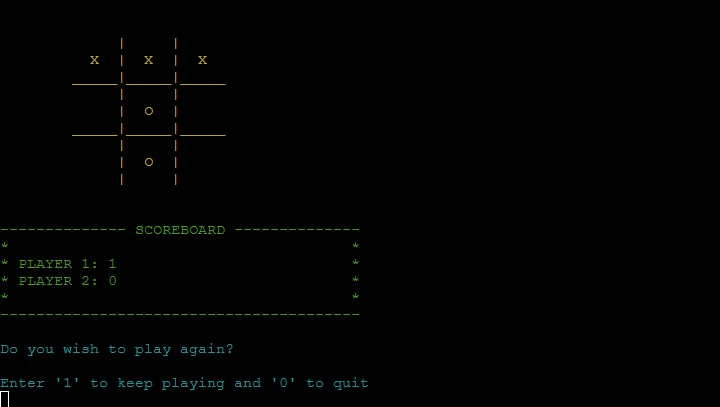

# Tic Tac Toe

[Link to Website](https://tic-tac-toe-amorieri-pp3.herokuapp.com/)

[GitHub Repo](https://github.com/aelfrith92/tic_tac_toe)

***

## About

Tic Tac Toe is a paper-and-pencil game for two players who take turns marking the spaces in a three-by-three grid with X or O. The player who succeeds in placing three of their marks in a horizontal, vertical, or diagonal row is the winner. It is a solved game, with a forced draw assuming best play from both players. From [Wikipedia](https://en.wikipedia.org/wiki/Tic-tac-toe)
This developed version allows you to choose between 'X', 'O', and '★' to play with.

***

## Index - Table of Contents

* [UX](#user-experience-research-and-design)
    * [Strategy](#Strategy)
    * [User Stories](#Stories)
    * [Aims](#Aims)
    * [Scope](#Scope)
    * [Features](#Features)
    * [Changes](#Planned_Changes)
    * [Flowchart](#Flowchart)
* [Surface and Colour](#FeaSurface_and_Colourtures)
* [Data Model](#Data-Model)
* [Manual Testing](#Manual-Testing)
* [Deployment](#Deployment)
* [Credits](#Credit)

***

## UX

### Strategy

Tic Tac Toe should be accessible to everyone. For this project, the user is guided step-by-step through the several options available, as well as instructions on how to enter personal preferences. 

The best experience is achieved by letting the user be in control of the game, even when unexpected events occur. 

#### Stories

* As a player... 
    * I want to define whether to play against PC or another person.
    * I want to choose the symbol to play with and let the other person do the same.
    * I want to read basic instructions on how to play.
    * I want to have some buffering time before next player's turn, to visualize the moves on the grid and to plan next.
    * I want to choose whether to play again or not.
    * I want to read error messages, should I enter an already-filled cell, an invalid character or an option not available.
    * I expect that the application will remember my preference in regard to game mode: 1v1 or 1vPC.
* As a returning user... 
    * I expect to find a user-friendly environment for new people invited to play.

#### Aims
* The application is able to run and instruct the user.
* The application will ask the user whether to re-run.
* The application offers room for customization.

### Scope

An essential approach is crucial to keep the game accessible to everyone. Audience is expected to know how to use an electronic device, like a laptop or a phone, to enter their inputs using the keyboard, either physical or digital.

#### Features
* The game is accessible to everyone, it is online, and does not require a special configuration.
* It welcomes the user and shows the numbers to be entered, by placing them into each cell of the game grid.
* It lets the user define whether to play against the PC or another person.
* It lets users choose their preference, in regard to the symbol.
* It lets the user know each player's choice. It returns a random assignment, should the second player be the PC.
* It shows the grid before each player's turn, to let them realize which move to play.
* It lets the user enter their move, returns an error in case of invalid input, and lets the user re-enter their input until valid.
* It lets the user visualize the new grid, once the move is played.
* It lets the user distinguish text, by colouring it with different colours.

#### Planned_Changes
* In future, the application will be smarter and PC will be able to actually follow/play the winning combinations. 
* In future, the application will be able to increase the level of difficulty.
* In future, player1 and player2 will alternate thorughout the game, when starting a new one.

#### Flowchart

A flowchart outlining the logic behind this application has been created using [Lucidchart](https://lucid.app/lucidchart/7fda5e46-5ff2-46ee-ac16-1751fb7ea2da/edit?viewport_loc=-689%2C-88%2C3072%2C1441%2C0_0&invitationId=inv_dfc612ba-8168-47c0-b9dd-82b96adb5b92). It served as guideline while coding the actual game.

### Surface_and_Colour

Given the essential colour combination, the application presents the user with contrasting colours which let the user differentiate the different messages, stages.

***

## Features

### Current Features

* A welcome message shows up as soon as the game starts, alongside the grid which shows what numbers to be entered to play 

* The first customization opportunity lets the user choose between two game modes: 1v1 or 1vPC. Then, the game invites the user to choose the symbol to play with: 'X', 'O', and '★'

* After defining preferences, the user is invited to play the first move. 

* Error messages are shown in red, should the user enter an invalid input.

* Finally, the game communicates the winner, if any.

### Future Features

* In future, the code will be refactored to avoid redundance.
* In future, the game will take note of ties in the scoreboard.

***

## Data-Model 

The overall strategy is based on the usage of a class, which creates 'Player' objects, having their attributes and methods. In particular, this application provides player1, player2, and the grid objects. The latter is not an actual player, but it is handy to have it as such, in consideration of shared features and methods. In future, further improvements may see the implementation of sub-classes and decorators as a potential optimization.

The game loop keeps being reiterated until the user wants to stop at the end. 

***

## Manual Testing 

### Code 

The code contained in run.py returned no errors when checked on [PEP8 online](http://pep8online.com/)

### Browser

The website hosting the application renders and is functional on the following browsers:
* Google Chrome
* Mozilla Firefox
* Safari
* Opera
* Microsoft Edge
* Microsoft Internet Explorer

The website does not render on any previous versions of Internet Explorer.

### Device

The overall experience is affected on mobile devices, such as tablets and smartphones, given the fixed dimensions of the terminal. However, devices which support a physical keyboard offer a better experience, given the nature of the terminal and the navigation opportunities throughout the game. Therefore, desktop environments offered the best UX, as well as navigation.

### Bugs

While writing the code, the following bugs have been documented in several commits:
* the IndexError was quite common, given the several data structures present in the code. The resolution has seen strategically-inserted 'spy-prints' to keep track of variables behaviour and journey. In more than one occasion, adding a '-1' or '+1' sufficed the struggle
* the ValueError was returned when expected, for this reason handled within the try-except structures
* the UnicodeDecodeError was returned when pressing an unrecognized key on the IT keyboard layout by mistake, for this reason handled within the try-except structures
* another mistake concerned the check of winning combinations inside a tuple of tuples. According to the solution found, a player wins whenever the check of each move matches the tuples and returns a True value at leas three times within the check_list variable.
* Syntax errors have been handles thanks to the IDE showing - most of time - the reason why an error occurred

## Deployment

### Project Creation
The project was started by navigating to the [template](https://github.com/Code-Institute-Org/python-essentials-template) and clicking 'Use this template'. Under Repository name I input "tic_tac_toe" and checked the Include all branches checkbox. I then navigated to the new [repository](https://github.com/aelfrith92/tic_tac_toe). 

Having Gitpod as main and only IDE, I forked the repo by hitting the button Gitpod top-right of the repo files list. 

The bash terminal within the Gitpod UI was already able to trigger commands like:

* git status - This command was used to check the status of edited files ready to be added to the staging area
* git add *.* - This command was used to add edited files to the staging area
* git commit -m *commit message explaining the updates* - This command was used to commit changes to the local repository
* git push - This command was used to push all commited changes to the GitHub repository  

### Deploying the project with Heroku
1. Navigate to the Heroku [Dashboard](https://dashboard.heroku.com/apps)
1. Create a new app.
1. Enter a name for the app and location.
1. In the settings tab, add a variable called PORT, value '8000'.
1. Scroll down to the Buildpacks section and add Python and JSON respectively.
1. In the Deploy tab, select 'Connect to Github' and pull the related repo.
1. At this point, either enable 'Automatic Deploys' or choose Manual Deploys.
1. Once it is built, the app is available and online by clicking on the 'View' button.

***
## Credits
### Code
- W3schools has been the main source of knowledge
- My mentor, Daisy McGirr, also suggested to pay attention to responsiveness, accessibility features, indentation, **commit signatures**.
### Content
All content was designed and created by me, the author of this project.

### Media
All graphic materials are fully licensed or free-to-use.

### Acknowledgements

I'd like to thank my mentor Daisy McGirr for his guidance throughout my project. 
Needless to mention, I would like to also thank my partner Valentina for her constant support throughout this adventure.